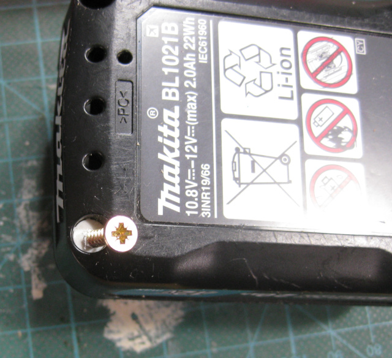
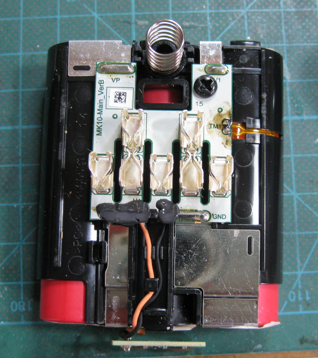
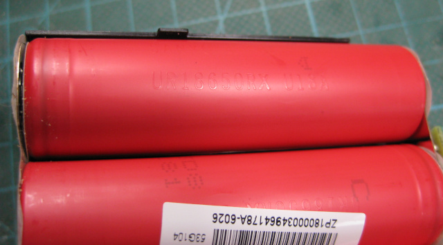
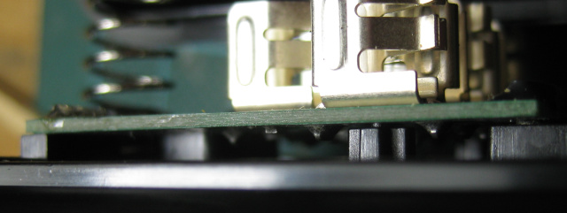
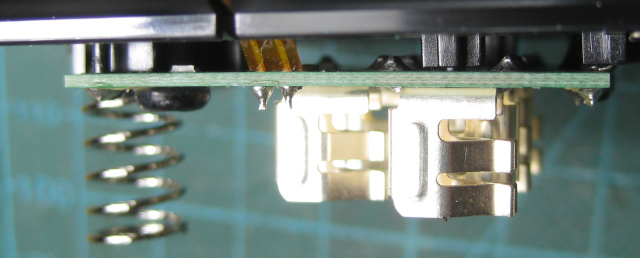
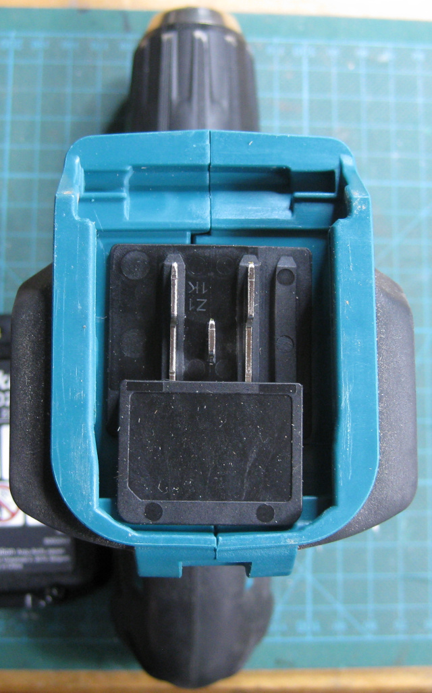
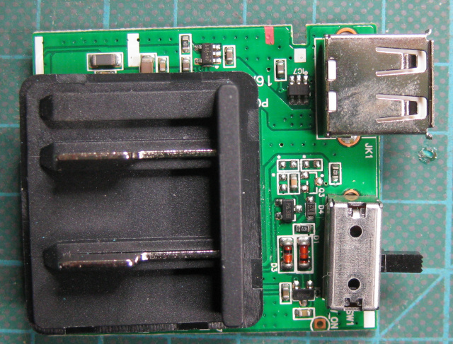
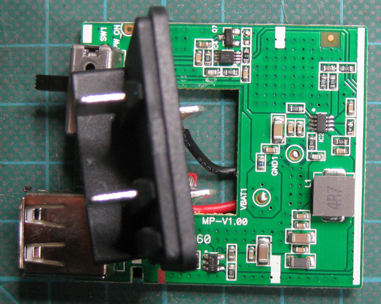
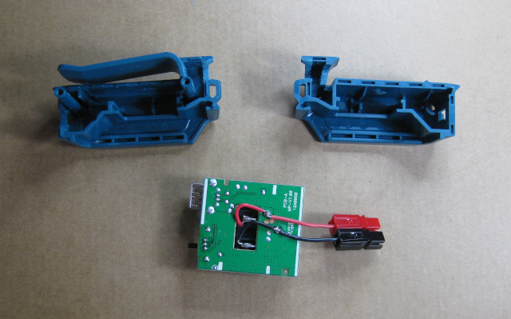
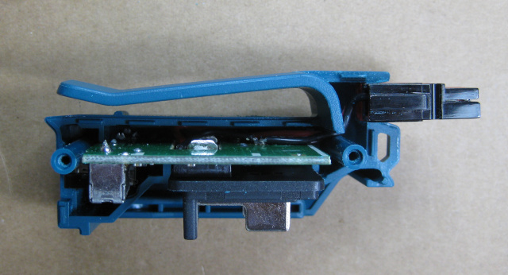

# Makita CXT 10.8v/12v battery details

> Disclaimer - knowledge here is only what I have found - use at your own peril :-
> This information comes with no warranty! If you don't know what you are doing with
> Li-Ion cells, then do more research - they can be dangerous.

I have a few [Makita CXT](https://makitauk.com/cxt) batteries for some power tools. There is
always the thought that they could be 're-purposed' for some other battery powered applications.
In my case that would be a portable radio transceiver.

These batteries are Lithium Ion (Li-Ion) based, and rated at 10.8v/12v, depending on how you measure it -
Li-Ion cells have a voltage ranging from 4.2v (freshly charged) to ~3v (flat), with a normal useable
voltage of ~3.6v. These packs contain 3 cells (or, depending on the pack, more cells in parallel
sets of 3) - 3x3.6v == 10.8v.

## How to connect

First thing then, we need a way to connect safely to the battery pack. There are some 3D printed
models out there to make your own adapters, or you can buy an adapter from China. I went with a
slightly more costly but more 'approved' route and purchased a Makita brand
[DEAADP06 USB adapter](https://makitauk.com/product/deaadp06). This would hopefully not only get
me an official 'connector', but also a USB charger if I needed it. My plan was to adapt this and
add some powerpole connections to it, if possible, keeping the USB charger circuit in place at the
same time.

## Battery safety

One concern was, if I were connecting the powerpoles directly to the cells or PCB in the adapter,
are there safety circuits in place to prevent over-discharge and over-current?

According to the Makita CXT web pages, it says:

> The slide battery fits easily into the tools and chargers and has the same high level of structural strength, as well as having in-built protection to prevent overload or over-discharging.

and lists the among the features:

> - Individual cell monitoring
> - Protection circuitry

Well, let's see if we can veryfy that. The last thing I want to be doing is draining the cells to
below their recommended limit - Li-Ion cells **really** don't like being drained too low. It would
also be great if there were some over-current protection (not that I expect to draw more current
than a power tool), or short circuit protection (that could come in handy...).

### Inside the battery

First we need to get into the battery. It is pretty simple, but you do have to remove a security
cover over one of the screws first - see the white 'blob' in the picture - I removed it by driving
a small screw into it and giving it a yank. It is just a plastic cover over the screw.

Obviously this will most likely void your warranty!

Then simply undo the four torx T-10 screws in the corners. I'd then recommend you flip the battery
over and lift the case off from the terminal side - that way you don't yank unduly on the battery
voltage indicator PCB. You should find something like:

To gain access to the other side of the cells, lift the small front battery status PCB out of its
slot and then ease the battery pack out of the other half of the case shell.

### Cell identification

On the first pack I opened I could not see any clear cell identification markings - I think they
were all facing towards the pcb :-(. On the second pack I opened nicely the markings were in plain
view:

We can see these are Sanyo (Panasonic)
[UR18650RX](https://b2b-api.panasonic.eu/file_stream/pids/fileversion/3450) cells. These are high
quality high drain cells. Some more details can be found
[here](https://secondlifestorage.com/index.php?threads/sanyo-ur18650rx-cell-specifications.1703/).
These cells can supply, and it looks like sustain, a 20A discharge current - ouch!

### Any protection on that PCB?

And here is 'the rub' - the question is, is there any protection built into the battery packs?

One reason I wanted to identify the cells was to check if they were 'protected' cells, that is, if
each individual cell carried its own protection circuity. I doubted they were, as high drain cells
are less likely to have built in protection, and you also have to lose a bit of capacity to the
accomodate the extra circuit.

That leaves protection being on the small pcb that houses the connectors. It is hard to see under
the small PCB, and I didn't want to unsolder it as I didn't want to take my working packs apart
quite that much (you have to unsolder the batteries...) - but, if we squint very hard under the
PCB the, well, I can't see any components, and definitely nothing that looks like it would be a
FET or similar that would happily handle the 20A current. Now, I could be wrong, maybe there is
small protection chip hiding under there somewhere, but I can't see it...

### Protection in the drill?

One possiblity then is that all the protection is handled in the charger (when charging) and
in the 'devices' when in use.

For the charger, we can see the battery has 5 connections. Two of those connections give access
across the individual cells, which would allow the charger to then monitor and balance the cells
as they charge. OK, let's do a bit of a pin breakout then whilst I have the info to hand...

If you lay the pack flat with the white release catch to the left, and the '-' terminal facing up
(away from you), then the pinouts look like:

| Pin | Description |
| --- | ----------- |
| top | first cell (4v from GND) |
| -   | Negative (GND) terminal |
| middle | Thermistor to GND |
| +   | Positive - third cell (12v from GND) |
| bottom | second cell (8v from GND) |

The charger will use the 'top' and 'bottom' connections to monitor and potentially balance the
cells in the pack. It likely also uses the middle thermistor connection to check for cell overheating.
You can see the thermistor connection coming out of the PCB and down to the side of one of the cells
in the PCB photos - the connection labelled 'TM1'.

I did measure the thermistor connection resistance to GND - it showed 18.5k with the pack at about
17 Centigrade. If I had to guess I'd say this is likely something like a 10k RTC device (resistance
will drop as the cell gets warmer).

If we take a look at the bottom of one of my drills, we see it
has three connectors:

As far as I can see then the drill has a connection to the thermistor, and presumably it cuts
out if the battery pack is getting too hot. I don't think it is a smart voltage detection circuit
such as that described for the 18v packs
[here](https://www.instructables.com/Making-a-Over-Discharge-Protection-for-Makita-Batt/).

Also have a look at the USB section below, where we see the USB adapter only has 2 connections.

### The USB adapter

I started this adventure wanting to modify the Makita CXT USB adapter so I could drive some other
devices. If we have a look at the internals of the USB adapter we can see that it only has two
contact pins, not three. The PCB is also reasonalby complex, with a few small semiconductors on it.

It is hard to identify what those are doing. The one near the USB socket is probably a USB charge
controller. I have to wonder if one of the other chips is maybe doing the cell protection, and cutting
off the rest of the cirucuit if the battery voltage is too low.

#### Adding PowerPoles

I've now added my PowerPole modification to the USB pack. After a lot of staring at the case I
eventually identified a place I could add the powerpole connectors in whilst still keeping the
USB charging circuit.

In the below picture you can see where I hollowed out space just behind the belt clip to place
the connectors. You can also see how I simply wired the connectors directly to the battery
terminals. I used some very flexible silicon 20awg, 0.5mm2 wires. Now, those are not going to
be rated for the full 20A these batteries are capable of delivering, but then I never expect to
pull more than maybe 5A maximum ever. If you are going to do this mod, make sure you use an
appropriately sized wire for you application.

Once you have made the hole in the case, do a test fit to ensure you get the correct lenght
of hookup wire. In the below picture you can see how the wires route internally past the belt
clip and the screw post to nicely land on the correct side of the PCB.

And finally, assemble your unit. Sadly there was not quite enough space in the belt clip area
to make a really nice secure fit around the groove in the powerpoles, so they stick out a little
further than necessary. I applied some toughened epoxy around the powerpole after fitup to ensure
a tight stable fit. That may make it slightly harder to get the case apart later if necessary,
but better to have the powerpoles not pulling out.

Here is the final unit fitted up to a battery. The USB adapter still works, and the powerpoles are
suppling 12.2v or thereabouts with a full pack. Success!

## Next steps

### Find a dead battery

If I can find a dead, used, defunct battery pack then I will tear the PCB down more to more
thoroughly check if it is hiding some protection circuitry somewhere.

> **If you have a dead battery** that you'd like to donate to me for further investigation, feel free
to get in touch!

### Check a flat battery

I should run a battery down until it 'stops working', and then check what the extra pin is telling
me (although thinking this is just a thermistor connection, I'm not sure it will tell me much),
and what state the cells are in. Ideally I'd do this with one of the Makita products, rather than
just draining direct off the battery.

## Conclusions

My advice right now is, if you are going to use CXT batteries for other purposes, be very aware that
there may be no native cell protection in the battery itself. Do not over-discharge the battery.
I'd also advise re-charging the battery as soon as you can just in case you have depleted it more
than it was designed for.

At least now we know what cells are in these batteries, so we can safely discharge at a supported rate
to a safe voltage, and if we have to re-cell a pack we have a good idea what sort of cell we need
to replace with.
